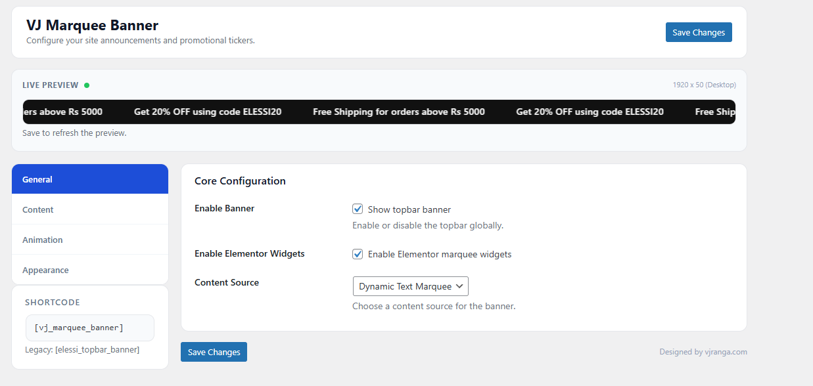

# VJ Marquee Banner

VJ Marquee Banner adds a scrolling announcement ticker above your site header. Create text or image marquees, or render an Elementor template, with a modern settings UI and live preview.

## Features
- Text marquee with multiple lines and optional link
- Image marquee with adjustable image height
- Elementor template support (Elementor Library and Header & Footer Builder)
- Custom colors, spacing, typography, and Google Font loading

## Installation
1. Download or clone this repository.
2. Upload the plugin files to `wp-content/plugins/vj-marquee-banner`.
3. Activate **VJ Marquee Banner** in WordPress.

## Usage
- Go to **Settings > VJ Marquee Banner** to configure the banner.
- Shortcode: `[vj_marquee_banner]`
- Legacy shortcode (backward compatibility): `[elessi_topbar_banner]`

## Elementor
- Elementor template support works with Elementor Library and Header & Footer Builder templates

## Compatibility
- Tested with the Elessi Theme
- Works with Elementor-compatible themes and Elementor template types

## Credits
Designed by vjranga.com
